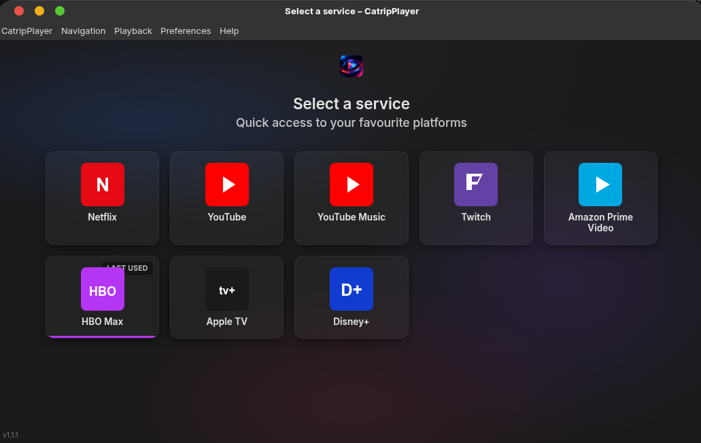
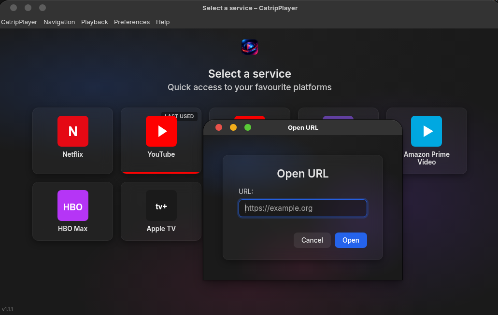
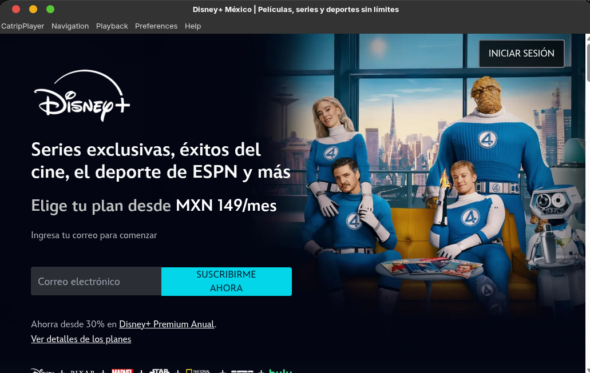
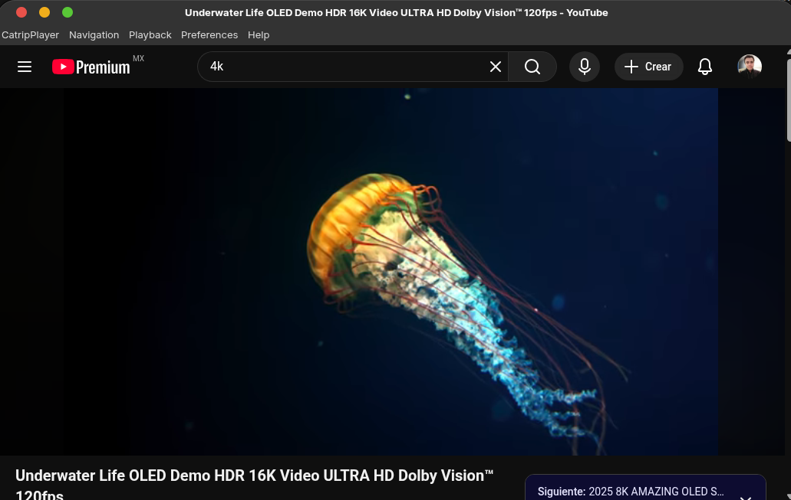

# CatripPlayer

<p align="center">
  
</p>

Unified streaming client for desktop. One window for Netflix, YouTube, Twitch, Amazon Prime Video, HBO Max, Apple TV, Crunchyroll, Disney+ and more. Built with **Electron** and **TypeScript** (Linux, Windows, and macOS).

 

---

## Description

CatripPlayer is a desktop app that centralizes access to video streaming platforms in a single **embedded Chromium** window. It includes:

- **Service menu** with a visual grid (Aura evolution: mesh gradient, ambient lighting, parallax, and animations).
- **Single window** that loads the chosen service’s website (Netflix, YouTube, etc.) with **Widevine (DRM)** support on Linux.
- **Internationalization (i18n):** Spanish, English, French, Portuguese, German, and Chinese. Language is set under **Preferences → Language** and applies to the menu, service screen, dialogs, and floating island.
- **Window options:** always on top, frameless (Floating Island), full screen, remember position and size.
- **Ad blocking** (optional, via Ghostery).
- **Persistent** preferences and last-used service (electron-store).
- **Custom URL** via a dialog that matches the app’s visual style (not a native system window).
- **Edit configuration:** Preferences → Edit configuration… opens the app’s `config.json` in the system editor.

---

## Screenshots

| Main menu | Custom URL dialog |
|-----------|-------------------|
| Service grid with quick access to streaming platforms. | Dialog to open any URL (Navigation → Custom URL… or Ctrl+O). |
|  |  |

| Amazon Prime Video | YouTube |
|--------------------|---------|
| Window showing the Amazon Prime Video service. | Window showing the YouTube service. |
|  |  |

---

## Requirements

- **Node.js** 18 or higher
- **npm** (or yarn / pnpm)

---

## Installation

```bash
git clone https://github.com/alktrip/catrip-player.git
cd catrip-player
npm install
```

> The app uses **CastLabs Electron** (Widevine) from GitHub. If `npm install` fails, ensure you can access `github.com/castlabs/electron-releases`.

---

## Development

```bash
npm start
```

TypeScript is compiled, the window opens, and the service menu is shown. From the grid or the **Navigation** menu you can open any platform; **Custom URL** (Ctrl+O) opens a dialog with the app’s style. Under **Preferences** you configure language, window, ads, visible services, startup service, and the option to edit the config file.

### Troubleshooting

| Issue | Solution |
|-------|----------|
| `libva error: i965_drv_video.so init failed` | The script already uses `LIBVA_DRIVER_NAME=iHD`. If it persists: `sudo apt install intel-media-va-driver-non-free`. |
| "Failed to install Widevine" (404) | The app still opens. Netflix requires CastLabs Electron (included). |
| Crash when opening Netflix | `npm start` already includes `--no-sandbox`. Without GPU: `electron . --no-sandbox --disable-gpu`. |
| "Update required" on Netflix | Use CastLabs Electron v38+ (Chrome 116+). The project uses `v38.7.2+wvcus`. |

---

## Build

```bash
npm run build
```

The **`release/`** folder is generated with:

- **Linux:** AppImage (portable) and .deb. Install the .deb: `sudo dpkg -i release/catripplayer_*.deb`. The package includes maintainer and correct .desktop metadata. Built when running the build on Linux.
- **Windows:** **NSIS** installer (.exe): setup wizard, choose folder, desktop and Start menu shortcut (x64). To build: `npm run build` on **Windows** or `npx electron-builder -c build/electron-builder.yml --win -p never` on Linux (cross-compile). Icon: `build/icon.ico`.
- **macOS:** From **Linux** or **Windows** a **.zip** is generated (`release/CatripPlayer-x.x.x-mac.zip`); the user extracts and drags the app to Applications. To get a **DMG** installer, run the build on **macOS** and uncomment the `dmg` line in `build/electron-builder.yml`. Icon: `build/icon.png` (512×512 px).

Icons are in **`build/`**: **`icon.png`** for Linux and macOS and **`icon.ico`** for Windows.

---

## Usage

| Action | How |
|--------|-----|
| **Open a service** | Click the card in the menu or **Navigation** → service name. |
| **Back to menu** | **Navigation** → Main menu (Ctrl+H) or **Playback** → Back to menu. |
| **Open any URL** | **Navigation** → Custom URL… (Ctrl+O). A dialog with the app’s style opens. |
| **Change language** | **Preferences** → Language → choose language (ES, EN, FR, PT, DE, ZH). The window reloads to apply. |
| **Always on top** | **Preferences** → Window → Always on top. |
| **Frameless window (Floating Island)** | **Preferences** → Window → Frameless window. The top bar becomes a centered pill that expands on hover. |
| **Block ads** | **Preferences** → Privacy → Block ads (requires restart). |
| **Show or hide services** | **Preferences** → Services → Visible services → check or uncheck each. |
| **Service on startup** | **Preferences** → Services → Service on startup (Main menu, Last opened page, or a specific service). |
| **Edit config manually** | **Preferences** → Edit configuration… (opens `config.json` in the system editor). |
| **Reset all** | **Preferences** → Reset preferences. |
| **Version** | **Help** → About CatripPlayer. |

---

## Included services

By default **Netflix**, **YouTube**, **Twitch**, **Amazon Prime Video**, **HBO Max**, **Apple TV**, **Crunchyroll**, **Disney+**, **Floatplane**, etc. are available. Visibility is controlled under **Preferences → Services → Visible services**.

---

## Project structure

```
CatripPlayer/
├── src/
│   ├── main.ts              # Main Electron process
│   ├── menu.ts              # Native menu (CatripPlayer, Navigation, Playback, Preferences, Help)
│   ├── i18n.ts              # Internationalization (locale, t, getUIStrings)
│   ├── default-services.ts  # Default service list
│   ├── preload.ts           # Preload (exposes IPC to renderer)
│   ├── client-header.js     # Injected bar in frameless mode (Floating Island)
│   ├── bootstrap.js         # Entry point (Widevine, etc.)
│   ├── locales/             # Translations (es, en, fr, pt, de, zh)
│   │   ├── es.json
│   │   ├── en.json
│   │   └── ...
│   └── ui/
│       ├── index.html       # Main menu (service selector)
│       ├── index.css        # Styles (Aura evolution, mesh gradient, cards)
│       ├── index.js         # Menu logic (parallax, morphing, loader, i18n strings)
│       ├── url-dialog.html  # Custom URL dialog (app style)
│       ├── url-dialog.css
│       ├── url-dialog.js
│       ├── logo.png
│       └── services/        # Icons per service (SVG)
├── build/
│   ├── electron-builder.yml # Packaging config (Linux, Windows, macOS)
│   ├── icon.png
│   └── icon.ico
├── docs/                    # Development plan, i18n, menus, etc.
├── LICENSE                  # GNU GPL v3.0
├── package.json
├── tsconfig.json
└── README.md
```

---

## Tech stack

| Component  | Technology |
|------------|------------|
| Runtime    | Node.js (Electron) |
| Language   | TypeScript (main), HTML/CSS/JS (UI) |
| UI         | `src/ui/` (menu, URL dialog, Aura styles) |
| i18n       | JSON in `src/locales/` (es, en, fr, pt, de, zh), module `src/i18n.ts` |
| Persistence| electron-store (`config.json` in userData) |
| DRM        | Electron CastLabs (Widevine), `v38.7.2+wvcus` |
| Packaging  | electron-builder (Linux: AppImage, deb; Windows: NSIS; macOS: zip/dmg) |

---

## License

GNU General Public License v3.0 (GPL-3.0). See [LICENSE](LICENSE) for the full text.
